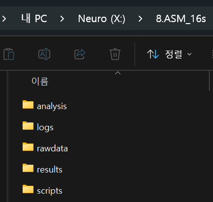

## R project란?

R Project(`.Rproj`)를 쓰면:

-   **작업 디렉토리가 자동 설정**
-   프로젝트별로 독립된 환경 유지
-   다른 컴퓨터에서 열어도 경로 문제 없음

### 권장 폴더 구조

``` {style="background-color: #f6f6f6"}
my_research_project/
├── my_research_project.Rproj
├── scripts/          # 분석 스크립트 (.R 파일)
│   ├── 1_table1.R
│   ├── 2_preprocessing.R
│   └── 3_figure.R
├── rawdata/          # 원본 데이터 (절대 수정 금지!)
│   └── clinical_data.xlsx
├── analysis/         # 중간 분석 결과
│   ├── 1_cleaned_data.rds
│   ├── 1_df_pt.rds
│   ├── 1_table1.rds
│   ├── 2_df_pt_processed.rds
│   ├── 3_cox_model.rds
│   ├── 3_cox_tidy.rds
└── results/          # 최종 산출물
    ├── Table1.docx
    ├── KM_OS.tiff
    └── forest_OS.tiff
```

{fig-align="center"}

::: callout-tip
### 핵심 원칙

1.  **rawdata는 절대 건드리지 않는다** — 원본은 읽기만 하고, 전처리 결과는 `analysis/`에 저장
2.  **스크립트에 번호를 붙인다** — 실행 순서가 명확해짐
3.  **results에는 최종본만** — 논문에 바로 들어갈 표와 그림
:::

## R Project 만들어보기

RStudio에서:

``` {style="background-color: #f6f6f6"}
File → New Project → New Directory → New Project
→ 프로젝트 이름 입력 (예: "SBRT_survival")
→ Create Project
```

{fig-align="center"}

{fig-align="center"}

그 다음 콘솔에서 폴더 생성:

```{r}
#| eval: false
# 폴더 구조 한 번에 만들기
dir.create("scripts")
dir.create("rawdata")
dir.create("analysis")
dir.create("results")
```
