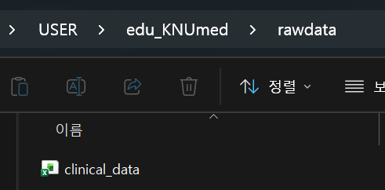
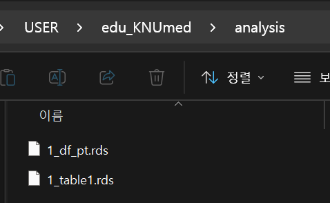
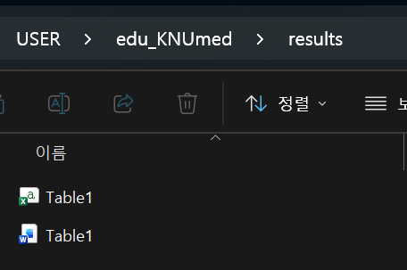

## Table 1이란?

논문의 첫 번째 표. 연구 대상의 기본 특성(baseline characteristics)을 요약합니다.

엑셀로 만들면:

-   연속형은 median(range) 직접 계산 → 복붙
-   범주형은 n(%) 직접 계산 → 복붙
-   p-value 따로 계산 → 복붙
-   변수 하나 바뀌면? **처음부터 다시**

R로 만들면: **코드 한 번 실행 → 끝**

------------------------------------------------------------------------

## ① 파라미터 설정 & 패키지 로드



```{r}
library(tidyverse)
library(readxl)
library(gtsummary)
library(flextable)

# ===== 디렉토리 설정 =====
indir  <- "rawdata/"
outdir <- "analysis/"
resdir <- "results/"

# ===== 파라미터 =====
DATA_FILE <- paste0(indir, "clinical_data.xlsx")
GROUP_VAR <- "Death"
```

::: callout-tip
## 경로 관리: `paste0()`

파일 경로를 하드코딩하면 디렉토리가 바뀔 때 일일이 수정해야 합니다. `indir`, `outdir`, `resdir`을 상단에서 한 번만 정의하고, 이후엔 `paste0()`로 조합하세요.

``` r
# ❌ 하드코딩
df <- read_excel("rawdata/clinical_data.xlsx")

# ✅ paste0 활용
df <- read_excel(paste0(indir, "clinical_data.xlsx"))
```

디렉토리 구조가 바뀌어도 상단 3줄만 고치면 됩니다.
:::

------------------------------------------------------------------------

## ② 데이터 읽기 & 구조 파악

```{r}
df <- read_excel(DATA_FILE)

# 데이터 확인
dim(df)     # 76행 x 33열
str(df)     # 변수 타입 한눈에
names(df)   # 변수 이름
head(df)    # 앞만 출력
```

### 데이터 구조 파악

이 데이터는 **환자-병변(lesion) pair**입니다. 한 환자가 여러 병변을 가질 수 있어요.

```{r}
# 환자 수 vs 병변 수
n_distinct(df$Key_pt)       # 환자 수
nrow(df)                    # 병변 수 (= 행 수)

# 환자당 병변 수 확인
df %>% count(Key_pt, sort = TRUE)
```

::: callout-warning
## 분석 단위 주의

-   **환자 단위 분석** (OS, Death) → `IN_sur == 1`인 행만 사용
-   **병변 단위 분석** (LF, LFFS) → 전체 행 사용
:::

```{r}
# 환자 단위: 환자당 1행만 남기기
df_pt <- df %>% filter(IN_sur == 1)
nrow(df_pt)
```

------------------------------------------------------------------------

## ③ 필요한 column select

Table 1에 넣을 변수만 골라냅니다. `select()`로 필요한 열만 뽑으세요.

```{r}
df_tbl <- df_pt %>%
  select(Sex, Age_Tx, Primary, Multiplicity, size_mm, TD, GTV_cc, PTVmean_BED10, Death)

names(df_pt)
```

```{r}
# 유용한 select 패턴들
df_pt %>% select(starts_with("PTV"))           # PTV로 시작하는 모든 columns
df_pt %>% select(Key_pt, Sex:OMD_Type)         # Sex에서 OMD_Type까지 선택
```

### 가장 간단한 Table 1

```{r}
df_tbl %>%
  tbl_summary()
```

이것만으로도:

-   연속형 → median (IQR) 자동 계산
-   범주형 → n (%) 자동 계산
-   결측치 자동 표시

------------------------------------------------------------------------

## ④ 그룹별 비교 + p-value

```{r}
tbl <- df_tbl %>%
  tbl_summary(
    by = Death,                          # 그룹 변수
    statistic = list(
      all_continuous() ~ "{median} ({p25}, {p75})",
      all_categorical() ~ "{n} ({p}%)"
    ),
    digits = list(
      all_continuous() ~ 1,
      all_categorical() ~ c(0, 1)
    )
  ) %>%
  add_p() %>%                            # p-value 자동 계산
  add_overall() %>%                      # Overall 컬럼 추가
  bold_labels()

tbl
```

::: callout-tip
## p-value 자동 선택

`add_p()`는 변수 타입에 따라 알아서 검정법을 선택합니다:

-   범주형 → chi-squared test (기대빈도 \< 5이면 Fisher's exact)
-   연속형 → Wilcoxon rank-sum test

검정법을 직접 지정하려면:

```{r}
#| eval: false
add_p(test = list(
  all_continuous() ~ "t.test",
  all_categorical() ~ "fisher.test"
))
```
:::

------------------------------------------------------------------------

## ⑤ 변수명 정리 (Labeling)

코드에서는 `Age_Tx`, `size_mm`이지만, 논문에서는 `Age at treatment`, `Tumor size (mm)`로 나와야 합니다.

```{r}
# 변수-라벨 매핑을 한 곳에서 관리
my_labels <- list(
  Age_Tx        ~ "Age at treatment",
  Sex           ~ "Sex",
  Primary       ~ "Primary site",
  Multiplicity  ~ "Multiplicity",
  size_mm       ~ "Tumor size (mm)",
  TD            ~ "Total dose (cGy)",
  GTV_cc        ~ "GTV volume (cc)",
  PTVmean_BED10 ~ "PTV mean BED₁₀ (Gy)"
)

tbl <- df_tbl %>%
    mutate(
    Death = factor(Death, levels = c(0, 1), labels = c("Alive", "Dead"))
  ) %>%
  tbl_summary(
    by = Death,
    label = my_labels,
    statistic = list(
      all_continuous() ~ "{median} ({p25}, {p75})",
      all_categorical() ~ "{n} ({p}%)"
    ),
    digits = list(
      all_continuous() ~ 1,
      all_categorical() ~ c(0, 1)
    )
  ) %>%
  add_p() %>%
  add_overall() %>%
  bold_labels()

tbl
```

::: callout-note
## 팁: label 재사용

`my_labels`를 한 번 정의해두면, 이후 Table 2, 3 등 여러 테이블에서 `label = my_labels`로 재사용할 수 있습니다.
:::

------------------------------------------------------------------------

## ⑥ 내보내기

### 중간 산물 → `.rds`

분석 파이프라인 중간에 생기는 데이터는 `.rds`로 저장합니다. 파일명 앞에 `1_`, `2_` 같은 번호를 붙이면 분석 순서를 한눈에 파악할 수 있습니다.

```{r}
# 전처리된 데이터 저장 (다음 스크립트에서 재사용)
saveRDS(df_pt, paste0(outdir, "1_df_pt.rds"))

# gtsummary 객체 저장 (나중에 합치거나 수정 가능)
saveRDS(tbl, paste0(outdir, "1_table1.rds"))
```

{width="683"}

### 최종 결과물 → Word / CSV

```{r}
# Word 파일 (논문 투고용)
tbl %>%
  as_flex_table() %>%
  flextable::save_as_docx(path = paste0(resdir, "Table1.docx"))

# CSV (공유/기록용)
tbl %>%
  as_tibble() %>%
  write_csv(paste0(resdir, "Table1.csv"))
```

{width="681"}

::: callout-note
## 저장 포맷 가이드

| 상황                                  | 포맷    | 이유                     |
|---------------------------------------|---------|--------------------------|
| 다음 스크립트에서 이어 쓸 중간 데이터 | `.rds`  | factor level, 타입 보존  |
| 공동연구자에게 공유                   | `.xlsx` | 비 R 사용자도 열 수 있음 |
| 다른 프로그램(Python 등)과 호환       | `.csv`  | 범용 포맷                |

파일 번호 예시: `1_df_pt.rds` → `1_table1.rds` → `2_km_result.rds`
:::

::: callout-important
## 핵심 포인트

리뷰어가 "BMI 대신 BSA를 넣어주세요"라고 하면?

```{r}
#| eval: false
# select()에서 변수 하나만 바꾸고 다시 실행 → 끝
df_tbl <- df_pt %>%
  select(Sex, Age_Tx, BSA, Primary, size_mm, TD, GTV_cc, PTVmean_BED10, Death)
```

엑셀로 했으면 30분, R이면 30초.
:::
