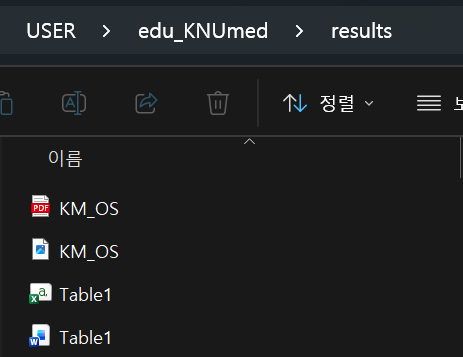

```{r}
library(tidyverse)
library(survival)
library(survminer)
library(broom)

# ===== 디렉토리 설정 =====
indir  <- "analysis/"
outdir <- "analysis/"
resdir <- "results/"

# ===== 데이터 로드 (2_2에서 저장한 rds) =====
df_pt <- readRDS(paste0(indir, "2_df_pt_processed.rds"))
```

::: callout-tip
## 실전 팁: R로 알맹이, PPT로 마무리

코드로 축 라벨, 폰트, 범례 위치까지 전부 조절하는 건 **비효율적**입니다. 실제 논문 작업에서는:

1.  **R**: 데이터 기반 알맹이(곡선, 점, 에러바)만 그린다
2.  **저장**: 고해상도 tiff/pdf로 내보낸다
3.  **PPT/일러스트**: 축 텍스트, 범례, 화살표, 주석 등 꾸미기는 여기서

코드로 `theme(axis.title = element_text(size = 12, face = "bold", family = "Arial"))` 이런 거 한 줄씩 바꿔가며 씨름하는 것보다 PPT에서 드래그 한 번이 **10배 빠릅니다**.

R에서는 **통계적으로 정확한 그래프를 만드는 것**에 집중하세요.
:::

## ① Kaplan-Meier Curve

### 기본 KM curve

```{r}
# 1. survfit 객체 만들기
fit <- survfit(Surv(OS, Death) ~ 1, data = df_pt)

# 2. 그리기
ggsurvplot(fit, data = df_pt)
```

### 그룹 비교 KM curve

```{r}
fit_mult <- survfit(Surv(OS, Death) ~ Multiplicity, data = df_pt)

ggsurvplot(
  fit_mult,
  data = df_pt,
  pval = TRUE,                    # log-rank p-value
  risk.table = TRUE,              # risk table
  xlab = "Time (months)",
  ylab = "Overall survival probability",
  palette = c("#5B4D80", "#E07A5F"),
  legend.title = "Multiplicity",
  legend.labs = c("Single", "Multiple"),
  ggtheme = theme_minimal()
)
```

::: callout-tip
## 자주 쓰는 옵션

| 옵션                      | 설명                  |
|---------------------------|-----------------------|
| `pval = TRUE`             | log-rank p-value 표시 |
| `conf.int = TRUE`         | 95% CI 표시           |
| `risk.table = TRUE`       | 하단 risk table       |
| `surv.median.line = "hv"` | median survival 선    |
| `break.time.by = 12`      | x축 간격 (12개월)     |
| `xlim = c(0, 60)`         | x축 범위              |
:::

### 논문용 KM curve

R에서는 통계적으로 정확한 그래프까지만. 세부 꾸미기는 PPT에서.

```{r}
fit_bed <- survfit(Surv(OS, Death) ~ BED_group, data = df_pt)

p <- ggsurvplot(
  fit_bed,
  data = df_pt,
  pval = TRUE,
  risk.table = TRUE,
  break.time.by = 12,
  palette = c("#5B4D80", "#E07A5F"),
  ggtheme = theme_classic()
)

print(p)
```

이 정도면 알맹이는 충분합니다. 축 라벨 폰트, 범례 위치, 주석 등은 저장 후 PPT에서 마무리하세요.

### 저장

```{r}
#| eval: false
# tiff (논문 투고용)
tiff(paste0(resdir, "KM_OS.tiff"), width = 7, height = 5, units = "in", res = 300)
print(p)
dev.off()

# pdf (벡터 포맷)
ggsave(paste0(resdir, "KM_OS.pdf"), plot = print(p), width = 7, height = 5)
```

------------------------------------------------------------------------

{width="721"}

## ② Forest Plot

### Cox regression 실행

```{r}
# Multivariable Cox
cox_model <- coxph(
  Surv(OS, Death) ~ Age_Tx + Sex + Multiplicity + size_mm + PTVmean_BED10,
  data = df_pt
)

summary(cox_model)
```

### broom으로 결과 추출

```{r}
# 통계 수치를 데이터프레임으로
cox_tidy <- tidy(cox_model, conf.int = TRUE, exponentiate = TRUE)
cox_tidy
```

::: callout-tip
## broom의 장점

`tidy(exponentiate = TRUE)` → HR, 95% CI, p-value가 바로 데이터프레임으로 나옴. 직접 타이핑할 필요 없어서 **오타 위험 제로**.
:::

### Forest plot 그리기

```{r}
# 변수 라벨 매핑
cox_tidy <- cox_tidy %>%
  mutate(
    label = case_when(
      term == "Age_Tx"                  ~ "Age",
      term == "SexM"                    ~ "Sex (Male)",
      term == "Multiplicitymultiple"    ~ "Multiplicity (Multiple)",
      term == "size_cm"                 ~ "Tumor size (cm)",
      term == "PTVmean_BED10"           ~ "PTV mean BED10",
      TRUE                              ~ term
    )
  )

# ggplot으로 forest plot
ggplot(cox_tidy, aes(x = estimate, y = reorder(label, estimate))) +
  geom_point(size = 3, color = "#5B4D80") +
  geom_errorbarh(
    aes(xmin = conf.low, xmax = conf.high),
    height = 0.2,
    color = "#5B4D80"
  ) +
  geom_vline(xintercept = 1, linetype = "dashed", color = "gray50") +
  scale_x_log10() +
  labs(
    x = "Hazard Ratio (95% CI)",
    y = NULL,
    title = "Multivariable Cox Regression: Overall Survival"
  ) +
  theme_minimal() +
  theme(
    plot.title = element_text(size = 13, face = "bold"),
    axis.text = element_text(size = 11)
  )
```

### 저장

```{r}
#| eval: false
ggsave(paste0(resdir, "forest_OS.tiff"), width = 8, height = 4, dpi = 300)
ggsave(paste0(resdir, "forest_OS.pdf"), width = 8, height = 4)
```

{fig-align="center"}

## ③ 중간 산물 저장

다음 스크립트에서 cox 결과를 재사용하려면 rds로 저장해두세요.

```{r}
#| eval: false
saveRDS(cox_model, paste0(outdir, "3_cox_model.rds"))
saveRDS(cox_tidy,  paste0(outdir, "3_cox_tidy.rds"))
```

{fig-align="center"}

------------------------------------------------------------------------

## 정리

✅ KM curve: survfit() → ggsurvplot() \
✅ Forest plot: coxph() → tidy() → ggplot() \
✅ broom::tidy()로 통계 수치 자동 추출 \
✅ tiff 300dpi로 저장 → 논문 투고 가능

### 다음

[Part 4](../part4/3_1_vibecoding.html): 바이브코딩과 마무리
